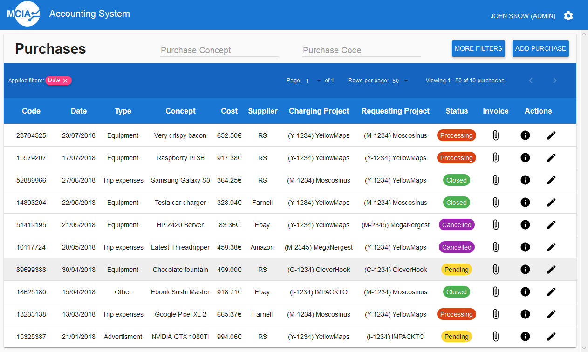

# accounting-backend

Backend for an internal accounting application. Its main features are:

 * Management of resources (purchases, projects, suppliers, employees, etc).

 * Tracking of the status of purchases (pending, issued, etc).

 * Storing PDF invoices of managed purchases.

 * Different user roles (admin, manager, user).

 * Provides an HTTP API for interacting with the managed resources.

 * Supports dynamic queries like: `/purchase?q=amount>123,supplier.name~amaz`.

## How it's made

The application is implemented using:

 * Spring Framework (Boot, Data, MVC, Security).

 * Kotlin.

 * MySQL.

## Web frontend

The web frontend is in a separate repository: [accounting-frontend][frontend], maintained by [@tortinez][tortinez].

The following is a screenshot of the running application:

Contributing
------------

Feedback or contributions are welcome!

Please create an issue to discuss it first :)

[frontend]: https://github.com/tortinez/accounting-frontend
[tortinez]: https://github.com/tortinez
